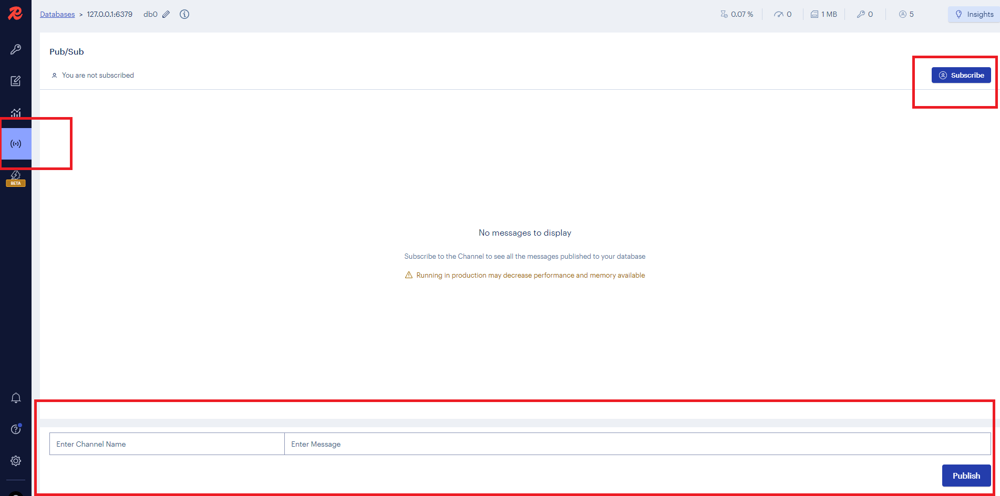

## Redis Pub - Sub

Redis Message Broker özelliği de barındırmaktadır. Oldukça basit konfigürasyonla etkili bir message broker niteliği taşır. Bu özellikle servislerimiz arasında asenkron iletişim sağlar.

Rediste Publish/subscribe kullanılmak isteniyorsa kod yazılmadan da <u>Redis CLI</u> ile yapılabilir.
Redis CLI genellikle Redisteki verileri düzenlemek ve pub/sub işlemlerini test etmek amacıyla kullanılır.

<u>Redis API'da kullanılabilir</u>. Redis Pub/Sub işlemlerini gerçekleştirebilmek için farklı dil ve platformlara sahip API'lar mevcuttur.Örneğin Node.js'de redis paketi, Pythonda redis-py .Net Core'da ise StackExchange.Redis kütüphanesi mevcuttur.
<u>Redis Insight</u> arayüzü üzerinden de pub/sub işlemleri yapılabilir.

### Redis CLI ile Pub/Sub

Redis'i docker'da ayağa kaldırdıktan sonra 3 powershell açalım ve
<strong>docker exec -it 609c520e0defc1af6cc45373e7045572bc43ddaadbd350b6bfc74afae76f8684 redis-cli --raw</strong>
komutu ile redis cli a bağlanalım. 609 lu kısım container'a ait id'dir.

Bu powershell'lerden 2 tanesinde consumer(subscriber) diğerinde ise publisher olarak çalışacak şekilde ayarlayalım.

1. Subscriberlarda : 'subscribe kanaladim' komutunu çalıştırıyoruz. Dinleyecekleri kanal adlarını verdik. Aynı kanal adı ile çalıştırdığımız için bu kanala gelen herhangi bir mesajı ikisi de alacak.
2. Publisher : publish 'kanaladim' 'mesajım' komutunu çalıştırıyoruz.
   ilgili kanala mesajım mesajını yayınlamış olduk.

### Redis Insight ile Pub/Sub

görseldeki panelden işaretli kısmı seçtikten sonra Subscribe olabilir ve altta yer alan kırmızı işaretli yerden mesajlarımızı publish edebiliriz.

### Redis.API ile Pub/Sub İşlemleri

1. StackExchange.Redis paketi projemize dahil edilir.
2. ConnectionMultiplexer class'ı üzerinden Redis sunucusuna bir bağlantı kurulur.
3. ISubscriber'dan bir subscriber oluştururuz.

Basit message broker ihtiyaçları için kullanılabilir.
Message broker olarak kullandığımızda kanal mantığıyla çalışır herhangi bir kuyruk mantığı yoktur.Message'lar fiziksel olarak depolanamaz.
Message'lar bir kanala publish edilir ve o kanalı dinleyen tüm subscriber'lar bu mesajı alır.

#### Redis Pattern-Matching Subscription

Redis, Pattern - Matching Subscription modeli sayesinde abonelerin belirli kalıplarda(pattern) ya da desenlerde mesajlar almasını sağlayabilir.
Bu sayede abonelerin belirli bir kalıba uyan mesajları almasını sağlayabiliriz.

Subscriber'ların farklı pattern'lara sahip olan kanaldan mesajlar almasını ya da mesajları filtrelemesini mümkün kılar.
Subscriber'ın sadece stock.* kanalına abone olmasını sağlayabiliriz.
Bu durumda stock.a, stock.1, stock.x gibi kanallardan gelen mesajları alırken news.1, news.x gibi kanallardan gelen mesajları filtrelemiş oluruz.

Uygulanması kolaydır. Subscriber servis'de Subscribe metodu kullanılırken kanal adı yerine pattern belirtilir.Örneğin stock.* gibi.

##### Powershell'den pattern matching ile subscribe işlemi
Subscriber'larda :
psubscribe mychannel:*  => komutu ile mychannel: ile başlayan tüm kanallara abone olabiliriz.
psubscribe mychannel.x  => komutu ile mychannel.x gibi belirli bir pattern'a abone olabiliriz. Sadece mychannel.x kanalına gelen mesajları alır.

Publisher'da :
publish mychannel.x "mesajım"  => komutu ile mychannel.x kanalına mesajım mesajını yayınlamış olduk.mychannel.* de mesajı almış oldu.