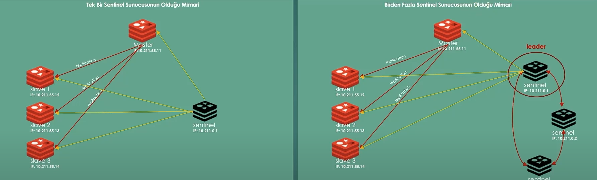

# Redis Sentinel

Redis'in kullanıldığı yapılanmalarda Redis yapısının <strong><u>sürdürülebilirliğini</u></strong> sağlayacaktır.
Redis kaynaklı bir kesinti sağlanmaması için kullanırız.

## Nedir?

Yoğunluk söz konusu olduğunda kesintisiz hizmet verme ihtiyacından dolayı ölçeklendirme davranışı sergilemeliyiz.Sunucu sayısını arttırarak çözüm bulmaya çalışırız.
Bir sistemin kesintisiz bir şekilde çalışması High Availability(yüksek kullanılabilirlik) olarak adlandırılır.
Sentinel, yüksek kullanılabilirlik sağlamak amacıyla geliştirilen bir yönetim servisidir.

Aşağıdaki durumlarda kullanırız :

1. Redis sunucusunun arızalanması durumunda Redis Sentinel ile farklı server'lardan devam edebilir ve hizmetin kesilmesinin önüne geçeriz.
2. Bakım ve güncelleme süreçlerinde : Redis sunucusu geçici olarak çalışmaz hale gelir ve bu süreçte hizmetin sürdürülmesi gerekir.
3. Yüksek Trafik : Redis sunucusunun performansı yetmeyebilir bu süreçte gecikmeler meydana gelebilir.Bu durumda Sentinel ile performanslı çalışmalar gerçekleştirilebilir.
4. Yedekleme ve geri yükleme 

## Temel Kavramlar

Sentinel'ın kullanılabilmesi için Replikasyon yapılması gerekir.

<u>Redis Sentinel, master-slave replikasyon sistemi üzerinde çalışan bir yönetim servisidir.Sentinel, Redis veritabanının sağlığını izler ve herhangi bir problem/kesinti meydana geldiğinde otomatik olarak failover(yük devretme) işlemini gerçekleştirerek farklı bir sunucu üzerinden hizmetin devamını sağlar.</u>

Yeni master belirlendiği durumlarda doğal olarak slave'ler yeni master'dan replikasyon yapmaya devam edecektir.

1. Master : Ana sunucu Create, Update, Delete
2. Slave : Readonly, Replication Sunucu
3. Sentinel : Master'ın sağlığını <u>sürekli</u> izleyecek ve sorun olduğu durumda yedek Redis sunucusunu otomatik olarak Master olarak belirler. Sentinel yapılanmasının merkezi bileşenidir.
4. Failover : Master'ın arızalanması durumunda Sentinel'in yaptığı yeni master belirleme işlemidir.Sentinel sunucusu, failover gerçekleştirdiğinde yeni Master'ın Ip'sini diğer slave'lere ileterek tüm sunucuların senkronize olmasını sağlar.
Fail olan master sunucu kullanılabilir hale geldiğinde slave olarak çalışmaya devam eder.
Sentinel, sisteme eklenen tüm slave sunucular hakkında bilgi toplar ve bir master belirler.

## Nasıl çalışır?

Bir adet ve birden fazla Sentinel Sunucu olabilir. Buradaki yaklaşımlar farklı olacaktır.



Sentinel sunucusu görseldeki gibi hem master'ın hem slave'lerin izlemesini gerçekleştirir.
Birden fazla sentinel olduğu durumda ise bir sentinel master ve slave'leri izler, lider pozisyonda olduğunu düşünebiliriz.Diğer sentinel'lar ise diğer sentinel'leri izlerler.
Sentinal sunucusu sistemdeki (master, slave, sentinel) tüm ip'leri hafızasında tutar.

## Yapılanma

1. Container'ların haberleşebilmesi için bir network oluşturmalıyız. 
    docker network create redis-network
2. Redis master sunucusu oluşturulur. 
    docker run -d --name redis-sentinel-master -p 6379:6379 --network redis-network redis redis-server
3. Redis slave'ler oluşturulur. 
    * docker run -d --name redis-slave1 -p 6380:6379 --network redis-network redis redis-server --slaveof redis-sentinel-master 6379
    * docker run -d --name redis-slave2 -p 6381:6379 --network redis-network redis redis-server --slaveof redis-sentinel-master 6379 
    * docker run -d --name redis-slave3 -p 6382:6379 --network redis-network redis redis-server --slaveof redis-sentinel-master 6379

4. Bir sentinel sunucusunun olduğu mimaride :
   * Bir dosya içerisinde konfigürasyonları yapacağız.<u>Dosya ismi farketmeksizin uzantısı kesinlikle .conf olmalıdır.</u>
    Sentinel tarafından izlenecek Master sunucu ip üzerinden belirlenir(internal-docker'ın içerisindeki iç ip) ve sentinel'de bir isim verilir(myMaster adını belirledik.) sonunda belirtilen 1 kaç tane sentinel olacağını belirtir:
        <p style="color:blue">sentinel monitor myMaster 172.18.0.2 6379 1</p>
    Master sunucunun yanıt vermemesi durumunda Sentinel'in bekleme süresi :
        <p style="color:blue">sentinel down-after-milliseconds myMaster 5000</p>
    Master sunucusunun yeniden yapılandırılması için Sentinel'ın beklemesi gereken süre :
        <p style="color:blue">sentinel failover-timeout myMaster 10000</p>
    Sentinel tarafından eşzamanlı olarak kullanılacak slave sayısı: 
        <p style="color:blue">sentinel parallel-syncs myMaster 3</p>

Sadece bu konfigürasyonları yapıyor olmamız yeterli yani slave'lerin ip'leri gibi bilgilere ihtiyaç yok bunu redis yapacak.


```bash 
docker inspect --format=='{{range .NetworkSettings.Networks}}{{.IPAddress}}{{end}}' redis-sentinel-master
```
komutu ile sonda yazdığımız docker'da çalışan redis-sentinel-master container'ının ip sini alabiliriz.Bizimkisi : 172.21.0.2
Port ise internal olarak Redis'in 6379'dur.

```bash 
 docker run -d --name redis-sentinel --network redis-network -v dosyayolu/dosyaadi.conf redis redis-sentinel
``` 

Birden fazla sentinel sunucusunun olduğu durumda sadece ilk adımdaki 1 sayısını arttırıyoruz ve sentinelleri ayağa kaldırıyoruz
  <p style="color:blue">sentinel monitor myMaster 172.18.0.2 6379 3</p>


  ```bash 
docker run -d --name redis-sentinel-1 -p 6383:26379 --network redis-network -v C:/Users/akdem/source/repos/InMemory_Distributed_Caching_Redis/sentinel.conf:/usr/local/etc/redis/sentinel.conf redis redis-sentinel /usr/local/etc/redis/sentinel.conf

docker run -d --name redis-sentinel-2 -p 6384:26379 --network redis-network -v C:/Users/akdem/source/repos/InMemory_Distributed_Caching_Redis/sentinel.conf:/usr/local/etc/redis/sentinel.conf redis redis-sentinel /usr/local/etc/redis/sentinel.conf

docker run -d --name redis-sentinel-3 -p 6385:26379 --network redis-network -v C:/Users/akdem/source/repos/InMemory_Distributed_Caching_Redis/sentinel.conf:/usr/local/etc/redis/sentinel.conf redis redis-sentinel /usr/local/etc/redis/sentinel.conf

``` 

```bash
docker inspect --format=='{{range .NetworkSettings.Networks}}{{.IPAddress}}{{end}}' $(docker ps -aq)
```  

komutuyla tüm container'lerin ip'sini görüntüleyebiliriz.
